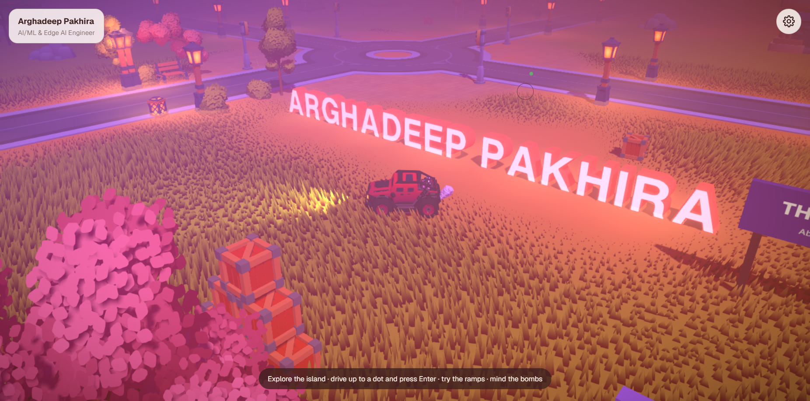

# Arghadeep Pakhira — Portfolio

A drivable 3D portfolio. Instead of scrolling a page, visitors drive a little car around an island to find my projects, skills, research and contact links. The world is built with React Three Fiber and the Rapier physics engine. It is inspired by [Bruno Simon's portfolio](https://bruno-simon.com).

There is also a conventional **classic view** at `/about` for anyone who'd rather read than drive.


<p align="center">
  
</p>

## Features

- **Open-world island:** roads, an F1-style race circuit, a 1.3 km adventure trail with obstacles, ponds you can splash through, and ramps.
- **Bombs:** Bruno-style explosive crates all over the island. Touch one and it ticks, then blows up in a fireball, chain-reacting through nearby crates.
- **Places to discover:**
  - Projects forge: browse projects on an in-world board.
  - Skills Camp, Research Arena and Design Graveyard.
  - The Village, home of About Me.
  - Contact plinth with statues for GitHub, LinkedIn, Kaggle, ORCID and Mail.
  - Out by the adventure trail: the Campus (education) and the Hall of Fame (awards & certifications).
- **Atmosphere:**
  - Stylised shading, wind-blown grass and water.
  - A 4-minute day/night cycle.
  - Live weather: rain, snow and storms with lightning.
- **Sound:** synthesised engine, impact and ambience effects, plus a background music playlist.
- **Island map:** press <kbd>M</kbd> for a top-down view of the island (rendered live, so it matches the time of day). Click a pin to drive straight there.
- **Settings menu (gear, top right):** sound, music, time of day, weather, graphics quality, race track, respawn and classic view.
- **Touch support:** on-screen joystick and lower graphics settings on phones.

## Controls

| Key | Action |
| --- | --- |
| <kbd>W</kbd> <kbd>A</kbd> <kbd>S</kbd> <kbd>D</kbd> / arrow keys | Drive |
| <kbd>Shift</kbd> | Boost |
| <kbd>Space</kbd> | Brake |
| <kbd>R</kbd> | Flip the car back over |
| <kbd>H</kbd> | Horn |
| <kbd>M</kbd> | Open / close the map |
| <kbd>Enter</kbd> | Interact with a glowing dot (open a project, link, …) |
| <kbd>Esc</kbd> | Close the map, settings or a board |

## Tech stack

- [Next.js 15](https://nextjs.org) (App Router) and React 19
- [three.js](https://threejs.org), [@react-three/fiber](https://r3f.docs.pmnd.rs) and [@react-three/drei](https://drei.docs.pmnd.rs)
- [@react-three/rapier](https://github.com/pmndrs/react-three-rapier) for physics, including a raycast vehicle
- [@react-three/postprocessing](https://github.com/pmndrs/react-postprocessing) for ambient occlusion, bloom, the intro reveal and fog
- [GSAP](https://gsap.com) for animation; the Web Audio API for sound

## Getting started

You need Node.js 18.18 or newer.

```bash
npm install
npm run dev
```

Then open <http://localhost:3000>.

| Script | What it does |
| --- | --- |
| `npm run dev` | Development server on port 3000 |
| `npm run build` | Production build |
| `npm start` | Serve the production build |

To make a production build **while the dev server is running**, build into a separate folder. Otherwise the build overwrites `.next` and breaks the dev server:

```bash
NEXT_DIST_DIR=.next-prod npx next build
```

## Deploying to Vercel

The site is a standard Next.js app, so Vercel needs no extra configuration.

1. Push this repository to GitHub (it lives at `github.com/Argha2004/Portfolio`).
2. On [vercel.com/new](https://vercel.com/new), import the repository. Vercel detects Next.js automatically; keep the defaults (build command `next build`, no environment variables needed).
3. Click **Deploy**. Every later push to `main` redeploys automatically, and other branches get preview URLs.

Or from the command line:

```bash
npx vercel        # preview deployment (asks you to log in the first time)
npx vercel --prod # production deployment
```

The sitemap is served at `/sitemap.xml` (`app/sitemap.js`). On Vercel its links use the project's production domain automatically; with a custom domain, set the `NEXT_PUBLIC_SITE_URL` environment variable (e.g. `https://your-domain.com`) so the sitemap points there.

## Project structure

```
app/
  page.js              Home: the 3D world
  about/               Classic (non-3D) portfolio page
  work/[slug]/         Project case-study pages
  globals.css          All styles, including the in-world HUD
components/
  world/               The 3D world (see below)
  Nav.js, Transition.js, Cursor.js, …   Shared UI for the classic pages
lib/
  data.js              Profile, socials, skills, education, awards
  projects.js          Project case studies
public/
  models/              GLB models (Bruno Simon + Kenney kits)
  sounds/music/        Background music
  projects/            Project screenshots
  draco/               Draco decoder for compressed models
legacy/                Earlier design experiments (not used by the site)
```

### Inside `components/world`

| File | Role |
| --- | --- |
| `World.js` | DOM layer: intro screen, HUD, settings, map overlay, info panel, joystick |
| `Scene.js` | The `<Canvas>`: lights, physics world, every area, post-processing |
| `Car.js`, `input.js` | Vehicle physics and keyboard / touch input |
| `terrain.js`, `grass.js` | Ground, water and grass, generated from the island layout |
| `zones.js`, `trackData.js`, `trailData.js` | Island layout: districts, ponds, circuit and trail paths |
| `areas.js`, `interactive.js` | Projects board and contact statues, plus the "press Enter" points |
| `Districts.js`, `Roads.js`, `Circuit.js`, `Trail.js`, `Props.js` | Scenery, tracks and the road junctions into the circuit |
| `Sections.js` | Campus and Hall of Fame |
| `Bombs.js` | Explosive crates, fireballs and chain reactions |
| `dayCycle.js`, `weather.js`, `Precipitation.js` | Day/night cycle, weather model, rain, snow and lightning |
| `brunoShading.js`, `Reveal.js` | Global stylised shading and the intro reveal / fog pass |
| `sound.js` | All sound effects and music |
| `IslandMap.js`, `mapCapture.js` | The island map (<kbd>M</kbd>): a live top-down render with clickable pins |
| `assets.js`, `preload.js` | List of every model and texture, preloaded in parallel |

## Editing content

- **Personal details, links and skills:** edit `lib/data.js`. The 3D world and the classic view both read from it.
- **Projects:** edit `lib/projects.js`. Each entry needs a `slug` (used for `/work/<slug>`) and can include an `image` from `public/projects/`.
- **Adding a 3D model:** put the `.glb` file in `public/models/<kit>/` and **add its path to `components/world/assets.js`**. Models on that list download in parallel during the intro. Models left off it still load, but one at a time, which slows the start-up noticeably.

## Credits

- **Bruno Simon:** the vehicle, trees, benches, lanterns, pole lights, fences, bricks, crates, and the projects / contact area models. Also the terrain, water, shading, weather and day-cycle techniques, adapted from [folio-2025](https://github.com/brunosimon/folio-2025). The map screen follows his map modal and uses his car marker (`public/ui/map/player.webp`). His code and models are MIT-licensed (`public/models/bruno/LICENSE-bruno-simon.md`). His personal and branded content (character, statue, career boards, award logos) is deliberately not used.
- **Music:** "Sudo", "Boy" and "Baguira" from Bruno Simon's portfolio, released under CC0 (`public/sounds/music/LICENSE-CC0.md`).
- **Kenney:** City Kit Roads, Graveyard Kit, Mini Arena and Mini Forest from [kenney.nl](https://kenney.nl), CC0 (`License.txt` in each `public/models/<kit>/` folder).
- **Sound effects:** synthesised in code (`components/world/sound.js`). No third-party audio files are used.

GitHub, LinkedIn, Kaggle and ORCID logos are trademarks of their respective owners. They are used only to link to my profiles.

## License

The source code is released under the [MIT License](LICENSE).

The MIT License covers the code only. The personal content (my name, résumé text, project write-ups and screenshots in `lib/` and `public/projects/`) is © Arghadeep Pakhira; please don't reuse it as your own. Third-party assets keep their own licences, listed in [Credits](#credits).
